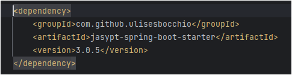

# springboot-jasypt-encryption-decryption
 
Application to demonstrate the use of
Jasypt to encrypt and decrypt and sensitive value in the application.

### What is Jasypt

Jasypt stands for 'Java Simplified Encryption'

Jasypt is a java library which allows the developer to add basic encryption capabilities to his/her projects with 
minimum effort, and without the need of having deep knowledge on how cryptography works.

### Spring Boot Jasypt Dependency



### Jasypt Secret Password

Provided as VM argument: -Djasypt.encryptor.password=mypassword


### OpenAPI Specification

OpenAPI swagger shows the API which uses Jasypt to encrypt and decrypt the input provided by user.

http://localhost:8080/my-application/swagger-ui/index.html


### Encrypt using Jasypt from Command Prompt

- Command:
```
java -cp jasypt-1.9.3.jar org.jasypt.intf.cli.JasyptPBEStringEncryptionCLI input="Deepak" password="hello" algorithm=PBEWithMD5AndDES
```


### Decrypt using Jasypt from Command Prompt

- Command:
```
java -cp jasypt-1.9.3.jar org.jasypt.intf.cli.JasyptPBEStringDecryptionCLI input="I4pJwX8EitE6PO1fLouLMw==" password="hello" algorithm=PBEWithMD5AndDES
```


